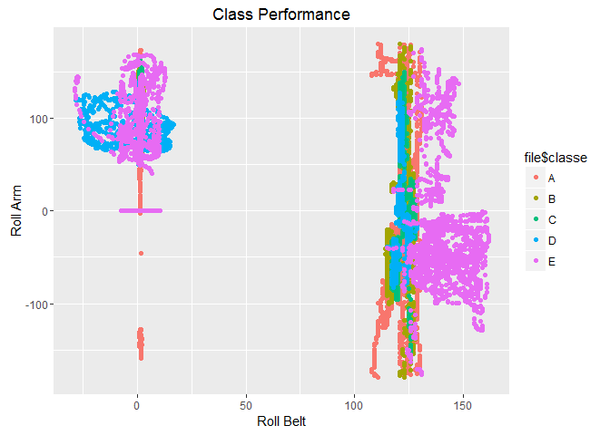

### Introduction

The purpose of this peer assessment is to develop a machine learning
algorithm for the provided 'Weight Lifting Exercises' dataset. This
dataset measures how well an activity, in this case biceps curl weight
lifting, was performed by the volunteer. Unlike most activity tracking
datasets which collect data towards an overall quantitative goal, the
'Weight Lifting Exercises' dataset collects quantitative data in order
to qualitatively measure the performance of the gym participant's
movement while lifting weights to see if they are performing the
exercise correctly. This data provides useful information for sporting
fields such as sports science.

According to the research paper cited below (see 'Sources' section), 6
participants wearing on-body sensors were asked to perform the dumbbell
biceps curl in 5 different ways. The first way, Class A, is the correct
way of performing the weight training exercise, whereas the other 4 ways
are not. The information collected by the sensors are included in the
dataset, with the goal of developing a machine learning algorithm which
allows for the prediction of each class given the sensor data. This
algorithm will then be applied on 20 test cases.

### Developing Machine Learning Algorithm

First, read the datafile and perform exploratory analysis.

    file <- read.csv ("File_Training.csv")
    dim (file)

    ## [1] 19622   160

    library (ggplot2)
    qplot (file$roll_belt, file$roll_arm, col = file$classe, xlab = "Roll Belt", ylab = "Roll Arm", main = "Class Performance")

Upon investigation of the dataset, many variables such as index number,
participants' names, and time stamps that will not contribute
meaningfully to the final outcome (class) will be excluded.
Additionally, a good amount of variables such as 'var\_accel\_dumbell'
and 'avg\_roll\_dumbbell' that contain exclusively "NA's" will be
excluded.

    new_file <- file [,-c(1:7, 12:36, 50:59, 69:83, 87:101, 103:112, 125:139, 141:150)]
    dim(new_file)

    ## [1] 19622    53

Now that we have developed our question/problem statement (i.e.,
qualitatively decide the class), analyzed our dataset, and determined
which features/variables to keep and leave out (build our model), the
next step is to come up with the best machine learning algorithm with
appropriate parameters.

Since our final predicted outcome is a factor/categorical variable, it
would make sense to use the classification tree model. However, a more
accurate model would be the random forest model, which is an ensemble
method that utilizes bagging and creates decision trees out of each
sample. Given a training set of 'N' observations, the random forest
method first creates 'N' sample cases at random with replacement. From
each sample used to grow the tree, a number m &lt; M input variables are
selected at random to split the node. At the end, a vote takes place for
each underlying tree, and the majority vote determines the prediction
value.

    library (caret)

    ## Loading required package: lattice

    library (randomForest)

    ## randomForest 4.6-10

    ## Type rfNews() to see new features/changes/bug fixes.

    ## 
    ## Attaching package: 'randomForest'

    ## The following object is masked from 'package:ggplot2':
    ## 
    ##     margin

    library (doParallel)

    ## Loading required package: foreach

    ## Loading required package: iterators

    ## Loading required package: parallel

    split <- createDataPartition (new_file$classe, p = 0.7, list = F)
    training_set <- new_file [split, ]
    testing_set <- new_file [-split, ]

    cluster <- makeCluster(detectCores() - 1)
    registerDoParallel(cluster)
    fitControl <- trainControl(method = "cv", number = 10, allowParallel = TRUE)
    fitModel <- train (classe ~ ., data = training_set, model = "rf", trainControl = fitControl)
    fitModel

    ## Random Forest 
    ## 
    ## 13737 samples
    ##    52 predictor
    ##     5 classes: 'A', 'B', 'C', 'D', 'E' 
    ## 
    ## No pre-processing
    ## Resampling: Bootstrapped (25 reps) 
    ## Summary of sample sizes: 13737, 13737, 13737, 13737, 13737, 13737, ... 
    ## Resampling results across tuning parameters:
    ## 
    ##   mtry  Accuracy   Kappa    
    ##    2    0.9891836  0.9863103
    ##   27    0.9881931  0.9850564
    ##   52    0.9787693  0.9731311
    ## 
    ## Accuracy was used to select the optimal model using  the largest value.
    ## The final value used for the model was mtry = 2.

First, we split the data into training and testing sets. Next, as seen
in the model-construction code above, K-fold cross-validation was
selected as the resampling method in place of the default option
(bootstrapping) in order to boost processing performance in exchange for
reduced model accuracy. The model accuracy will be shown in the results
above. However, the out-of-sample error rate (1 - accuracy/100) will be
higher in the testing set because the fitted model does not take factors
such as overfitting and noise from the testing set into account.

Now, let's use our fitted model to predict the testing set and determine
its accuracy.

    pred <- predict (fitModel, testing_set)
    mean (pred == testing_set$classe) * 100

    ## [1] 99.20136

With the model building process now complete, we will use our fitted
model to predict the 20 test cases in the quiz.

### Sources

Velloso, E.; Bulling, A.; Gellersen, H.; Ugulino, W.; Fuks, H.
Qualitative Activity Recognition of Weight Lifting Exercises.
Proceedings of 4th International Conference in Cooperation with SIGCHI
(Augmented Human '13) . Stuttgart, Germany: ACM SIGCHI, 2013.

Random Forests
<https://www.stat.berkeley.edu/~breiman/RandomForests/cc_home.htm#overview>

Improving Performance of Random Forest in caret::train()
<https://github.com/lgreski/datasciencectacontent/blob/master/markdown/pml-randomForestPerformance.md>
 
